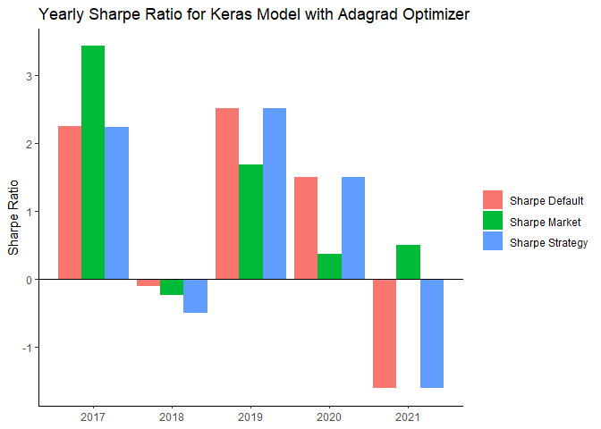

Business Analytics Capstone Final Project
================
Matt
3/31/2021

``` r
#uncomment line to install pacman
# install.packages("pacman")
pacman::p_load(tidyverse, tidymodels, lubridate, randomForest, xgboost, kernlab, nnet, kknn, rules)
theme_set(theme_classic())
```

## Load Data

``` r
aapl <- read_csv("AAPL.csv")
```

    ## Rows: 1258 Columns: 7

    ## -- Column specification --------------------------------------------------------
    ## Delimiter: ","
    ## dbl  (6): Open, High, Low, Close, Adj Close, Volume
    ## date (1): Date

    ## 
    ## i Use `spec()` to retrieve the full column specification for this data.
    ## i Specify the column types or set `show_col_types = FALSE` to quiet this message.

``` r
djia <- read_csv("DJIA.csv")
```

    ## Rows: 1261 Columns: 5

    ## -- Column specification --------------------------------------------------------
    ## Delimiter: ","
    ## chr (1): Date
    ## dbl (4): Open, High, Low, Close

    ## 
    ## i Use `spec()` to retrieve the full column specification for this data.
    ## i Specify the column types or set `show_col_types = FALSE` to quiet this message.

``` r
djia <- djia %>% 
  mutate(Date = as.Date(Date, format = "%m/%d/%Y"))
```

``` r
aapl <- aapl %>% 
  mutate(daily_return = Close/lag(Close) - 1) %>% 
  filter(!is.na(daily_return))
djia <- djia %>% 
  mutate(daily_return = Close/lag(Close) - 1) %>% 
  filter(!is.na(daily_return) & Date >= "2016-03-11")
```

``` r
moving_period <- 20
aapl$moving_average <- NA
aapl$decision <- NA
aapl$holding <- 0
aapl$investment_return <- 0

n <- nrow(aapl)
for (t in moving_period + 1:(n-20)) {
  moving_average <- mean(aapl$Close[(t - moving_period):(t - 1)])
  open_price <- aapl$Open[t]
  previous_holding <- aapl$holding[t - 1]
  
  if (moving_average > open_price) {
    decision = "S"  
  }
  else if (moving_average <= open_price) {
    decision = "B"
  }
  
  
  if (decision == "S") {
    holding = 0
  }
  else if (decision == "B") {
    holding = 1
  }
  
  
  if (previous_holding == 0 & decision == "B") {
    investment_return = aapl$Close[t] / aapl$Open[t] - 1
  }
  else if (previous_holding == 0 & decision == "S") {
    investment_return = 0
  }
  else if (previous_holding == 1 & decision == "B") {
    investment_return = aapl$Close[t] / aapl$Close[t - 1] - 1
  }
  else if (previous_holding == 1 & decision == "S") {
    investment_return = aapl$Open[t] / aapl$Close[t - 1] - 1
  }
  
  aapl$moving_average[t] <- moving_average
  aapl$decision[t] <- decision
  aapl$holding[t] <- holding
  aapl$investment_return[t] <- investment_return
}
```

``` r
aapl <- aapl %>% 
  filter(!is.na(moving_average))
aapl$trading_decision <- NA
aapl$pred_difference <- 0
aapl$pred_daily_return_low <- 0
aapl$pred_daily_return_high <- 0 
aapl$pred_daily_return_sd <- 0
aapl$pred_daily_return_avg <- 0

n <- nrow(aapl)
for (t in 4:(n - 3)) {
  if (aapl$investment_return[t + 3] > 0.002) {
    trading_decision = "B"
  }
  else if (aapl$investment_return[t + 3] < (-0.001)) {
    trading_decision = "S"
  }
  else if (aapl$investment_return[t + 3] <= 0.002 | aapl$investment_return[t + 3] >= (-0.001)) {
    trading_decision = "K"
  }
  aapl$trading_decision[t] = trading_decision
  
  
  aapl$pred_difference[t] = max(aapl$High[(t - 3):(t - 1)]) - min(aapl$Low[(t - 3):(t - 1)])
  aapl$pred_daily_return_low[t] = min(aapl$daily_return[(t - 3):(t - 1)])
  aapl$pred_daily_return_high[t] = max(aapl$daily_return[(t - 3):(t - 1)])
  aapl$pred_daily_return_sd[t] = sd(aapl$daily_return[(t - 3):(t - 1)])
  aapl$pred_daily_return_avg[t] = mean(aapl$daily_return[(t - 3):(t - 1)])
}
```

``` r
aapl <- aapl %>% 
  filter(!is.na(trading_decision)) %>% 
  mutate(trading_decision = as.factor(trading_decision))
```

``` r
aapl %>% 
  select(pred_difference, pred_daily_return_low, pred_daily_return_high, pred_daily_return_sd,
         pred_daily_return_avg) %>% 
  summary()
```

    ##  pred_difference   pred_daily_return_low pred_daily_return_high
    ##  Min.   : 0.2425   Min.   :-0.128647     Min.   :-0.025235     
    ##  1st Qu.: 0.8788   1st Qu.:-0.017644     1st Qu.: 0.005491     
    ##  Median : 1.5175   Median :-0.007682     Median : 0.012298     
    ##  Mean   : 2.4535   Mean   :-0.012292     Mean   : 0.015663     
    ##  3rd Qu.: 2.9950   3rd Qu.:-0.002231     3rd Qu.: 0.021038     
    ##  Max.   :27.0900   Max.   : 0.023805     Max.   : 0.119808     
    ##  pred_daily_return_sd pred_daily_return_avg
    ##  Min.   :0.0002799    Min.   :-0.048898    
    ##  1st Qu.:0.0061907    1st Qu.:-0.003981    
    ##  Median :0.0107993    Median : 0.001779    
    ##  Mean   :0.0146375    Mean   : 0.001418    
    ##  3rd Qu.:0.0182455    3rd Qu.: 0.006802    
    ##  Max.   :0.1356425    Max.   : 0.049147

``` r
table(aapl$trading_decision)
```

    ## 
    ##   B   K   S 
    ## 410 467 354

``` r
model_list <- NULL
set.seed(42)
evaluate_model <- function(model, use_engine){
  for (t in 1:5) {
    tidy_recipe <- recipe(trading_decision ~ pred_difference + pred_daily_return_low + pred_daily_return_high + 
                          pred_daily_return_sd + pred_daily_return_avg,
                          data = subset(aapl, year(Date) == 2015 + t))
    tidy_model <- model %>% 
      set_engine(use_engine) %>% 
      set_mode("classification")
    tidy_workflow <- workflow() %>% 
      add_recipe(tidy_recipe) %>% 
      add_model(tidy_model)
    
    model_list[[t]] <- fit(tidy_workflow, data = subset(aapl, year(Date) == 2016 + t))
  }
  
  trading_signal <- NULL
  for (t in 1:5) {
    trading_signal[[t]] <- predict(model_list[[t]],
                                   new_data = subset(aapl, year(Date) == 2016 + t),
                                   type = "class")
  }
  
  trading_data <- subset(aapl, year(Date) >= 2017)
  trading_data$trading_signal <- unlist(trading_signal, use.names = F)
  
  signal_table <- table(trading_data$trading_signal)
  
  # Implement Trading
  trading_data$trade_holding <- 0
  trading_data$trade_return <- 0
  
  for (t in 2:nrow(trading_data)){
    previous_holding = trading_data$trade_holding[t - 1]
    current_signal = trading_data$trading_signal[t]
    
    if(previous_holding == 0 & current_signal == "B") {
      holding = 1
      invest_ret = 0
    }
    if (previous_holding == 0 & current_signal == "S") {
      holding = 0
      invest_ret = 0
    }
    if (previous_holding == 0 & current_signal == "K") {
      holding = 0
      invest_ret = 0
    }
    if (previous_holding == 1 & current_signal == "B") {
      holding = 1
      invest_ret = trading_data$daily_return[t]
    }
    if (previous_holding == 1 & current_signal == "S") {
      holding = 0
      invest_ret = 0
    }
    if (previous_holding == 1 & current_signal == "K") {
      holding = 1
      invest_ret = trading_data$daily_return[t]
    }
    
    trading_data$trade_holding[t] = holding
    trading_data$trade_return[t] = invest_ret
  }
  
  djia <- djia %>% 
    mutate(djia_return = daily_return) %>% 
    select(c(Date, djia_return))
  
  trading_detail <- trading_data %>% 
    left_join(djia, by = "Date")
  
  trading_detail$Year <- year(trading_detail$Date)
  
  # Sharpe Ratio
  sharpe_year <- trading_detail %>%
    group_by(Year) %>%
    summarise(sharpe_invest = sqrt(252) * mean(trade_return) / sd(trade_return),
              sharpe_stock = sqrt(252) * mean(daily_return) / sd(daily_return),
              sharpe_market = sqrt(252) * mean(djia_return) / sd(djia_return))
  sharpe_total <- trading_detail %>%
    summarise(sharpe_invest = sqrt(252) * mean(trade_return) / sd(trade_return),
              sharpe_stock = sqrt(252) * mean(daily_return) / sd(daily_return),
              sharpe_market = sqrt(252) * mean(djia_return) / sd(djia_return))
  
  # Jensens Alpha
  jensens_year_strategy <- trading_detail %>% 
    group_by(Year) %>% 
    summarise(alpha = 252 * coef(lm(trade_return ~ djia_return))[1])
  jensens_total_strategy <- trading_detail %>% 
    summarize(alpha = 252 * coef(lm(trade_return ~ djia_return))[1])
  
  jensens_year_no_strategy <- trading_detail %>% 
    group_by(Year) %>% 
    summarise(alpha = 252 * coef(lm(daily_return ~ djia_return))[1])
  jensens_total_no_strategy <- trading_detail %>% 
    summarize(alpha = 252 * coef(lm(daily_return ~ djia_return))[1])
  
  
  return_list <- list(sharpe_year, sharpe_total, jensens_year_strategy, jensens_total_strategy, 
                      jensens_year_no_strategy, jensens_total_no_strategy, signal_table)
  return(return_list)
}
```

``` r
plot_yearly_sharpe <- function(data, model_type) {
  data[1] %>% 
    as.data.frame() %>% 
    rename("Sharpe Strategy" = "sharpe_invest",
           "Sharpe Default" = "sharpe_stock",
           "Sharpe Market" = "sharpe_market") %>% 
    pivot_longer(!Year) %>% 
    ggplot(aes(x = Year, y = value, fill = name)) +
      geom_col(position = "dodge") +
      geom_hline(yintercept = 0) +
      labs(x = NULL, y = "Sharpe Ratio", title = sprintf("Yearly Sharpe Ratio for %s", model_type),
           fill = NULL)
}
```

``` r
plot_yearly_alpha <- function(strategy_alpha, no_strategy_alpha, model_type){
  strategy_alpha %>% 
    as.data.frame() %>% 
    left_join(no_strategy_alpha %>% 
                as.data.frame(), by = "Year") %>% 
    rename("Alpha Strategy" = "alpha.x",
           "Alpha No Strategy" = "alpha.y") %>% 
    pivot_longer(!Year) %>% 
    ggplot(aes(x = Year, y = value, fill = name)) +
      geom_col(position = "dodge") +
      labs(x = NULL, y = "Alpha", title = sprintf("Yearly Alpha Comparison for %s", model_type),
           fill = NULL) +
      scale_y_continuous(labels = scales::percent, limits = c(-1, 1))
}
```

### Random Forest

``` r
rand_forest_model <- evaluate_model(rand_forest(), "randomForest")
```

``` r
plot_yearly_sharpe(rand_forest_model[1], "Random Forest Model")
```

<!-- -->

``` r
plot_yearly_alpha(rand_forest_model[3], rand_forest_model[5], "Random Forest Model")
```

<!-- -->

``` r
print(rand_forest_model[2])
```

    ## [[1]]
    ## # A tibble: 1 x 3
    ##   sharpe_invest sharpe_stock sharpe_market
    ##           <dbl>        <dbl>         <dbl>
    ## 1          1.72         1.24         0.611

``` r
print(rand_forest_model[4])
```

    ## [[1]]
    ## # A tibble: 1 x 1
    ##   alpha
    ##   <dbl>
    ## 1 0.224

``` r
print(rand_forest_model[6])
```

    ## [[1]]
    ## # A tibble: 1 x 1
    ##   alpha
    ##   <dbl>
    ## 1 0.254

### XGBoost

``` r
xgboost_model <- evaluate_model(boost_tree(), "xgboost")
```

    ## [10:43:51] WARNING: amalgamation/../src/learner.cc:1095: Starting in XGBoost 1.3.0, the default evaluation metric used with the objective 'multi:softprob' was changed from 'merror' to 'mlogloss'. Explicitly set eval_metric if you'd like to restore the old behavior.
    ## [10:43:51] WARNING: amalgamation/../src/learner.cc:1095: Starting in XGBoost 1.3.0, the default evaluation metric used with the objective 'multi:softprob' was changed from 'merror' to 'mlogloss'. Explicitly set eval_metric if you'd like to restore the old behavior.
    ## [10:43:51] WARNING: amalgamation/../src/learner.cc:1095: Starting in XGBoost 1.3.0, the default evaluation metric used with the objective 'multi:softprob' was changed from 'merror' to 'mlogloss'. Explicitly set eval_metric if you'd like to restore the old behavior.
    ## [10:43:51] WARNING: amalgamation/../src/learner.cc:1095: Starting in XGBoost 1.3.0, the default evaluation metric used with the objective 'multi:softprob' was changed from 'merror' to 'mlogloss'. Explicitly set eval_metric if you'd like to restore the old behavior.
    ## [10:43:52] WARNING: amalgamation/../src/learner.cc:1095: Starting in XGBoost 1.3.0, the default evaluation metric used with the objective 'multi:softprob' was changed from 'merror' to 'mlogloss'. Explicitly set eval_metric if you'd like to restore the old behavior.

``` r
plot_yearly_sharpe(xgboost_model[1], "XGBoost Model")
```

<!-- -->

``` r
plot_yearly_alpha(xgboost_model[3], xgboost_model[5], "XGBoost Model")
```

<!-- -->

``` r
print(xgboost_model[2])
```

    ## [[1]]
    ## # A tibble: 1 x 3
    ##   sharpe_invest sharpe_stock sharpe_market
    ##           <dbl>        <dbl>         <dbl>
    ## 1          1.81         1.24         0.611

``` r
print(xgboost_model[4])
```

    ## [[1]]
    ## # A tibble: 1 x 1
    ##   alpha
    ##   <dbl>
    ## 1 0.237

``` r
print(xgboost_model[6])
```

    ## [[1]]
    ## # A tibble: 1 x 1
    ##   alpha
    ##   <dbl>
    ## 1 0.254

### SVM

``` r
svm_model <- evaluate_model(svm_poly(), "kernlab")
```

    ##  Setting default kernel parameters  
    ##  Setting default kernel parameters  
    ##  Setting default kernel parameters  
    ## maximum number of iterations reached -0.0007250487 -0.0007300004 Setting default kernel parameters  
    ##  Setting default kernel parameters

``` r
plot_yearly_sharpe(svm_model[1], "Support Vector Machine")
```

<!-- -->

``` r
plot_yearly_alpha(svm_model[3], svm_model[5], "Support Vector Machine")
```

<!-- -->

``` r
print(svm_model[2])
```

    ## [[1]]
    ## # A tibble: 1 x 3
    ##   sharpe_invest sharpe_stock sharpe_market
    ##           <dbl>        <dbl>         <dbl>
    ## 1          1.57         1.24         0.611

``` r
print(svm_model[4])
```

    ## [[1]]
    ## # A tibble: 1 x 1
    ##   alpha
    ##   <dbl>
    ## 1 0.323

``` r
print(svm_model[6])
```

    ## [[1]]
    ## # A tibble: 1 x 1
    ##   alpha
    ##   <dbl>
    ## 1 0.254

### KNN

``` r
knn_model <- evaluate_model(nearest_neighbor(), "kknn")
```

``` r
plot_yearly_sharpe(knn_model[1], "KNN Model")
```

<!-- -->

``` r
plot_yearly_alpha(knn_model[3], knn_model[5], "KNN Model")
```

<!-- -->

``` r
print(knn_model[2])
```

    ## [[1]]
    ## # A tibble: 1 x 3
    ##   sharpe_invest sharpe_stock sharpe_market
    ##           <dbl>        <dbl>         <dbl>
    ## 1          1.20         1.24         0.611

``` r
print(knn_model[4])
```

    ## [[1]]
    ## # A tibble: 1 x 1
    ##   alpha
    ##   <dbl>
    ## 1 0.164

``` r
print(knn_model[6])
```

    ## [[1]]
    ## # A tibble: 1 x 1
    ##   alpha
    ##   <dbl>
    ## 1 0.254

### Logisitic Regression

``` r
log_model <- evaluate_model(logistic_reg(), "glm")
```

``` r
plot_yearly_sharpe(log_model[1], "Logistic Regression Model")
```

<!-- -->

``` r
plot_yearly_alpha(log_model[3], log_model[5], "Logistic Regression Model")
```

<!-- -->

``` r
print(log_model[2])
```

    ## [[1]]
    ## # A tibble: 1 x 3
    ##   sharpe_invest sharpe_stock sharpe_market
    ##           <dbl>        <dbl>         <dbl>
    ## 1          1.21         1.24         0.611

``` r
print(log_model[4])
```

    ## [[1]]
    ## # A tibble: 1 x 1
    ##   alpha
    ##   <dbl>
    ## 1 0.248

``` r
print(log_model[6])
```

    ## [[1]]
    ## # A tibble: 1 x 1
    ##   alpha
    ##   <dbl>
    ## 1 0.254

### C5.0 Rules

``` r
c5_rule_model <- evaluate_model(C5_rules(), "C5.0")
```

``` r
plot_yearly_sharpe(c5_rule_model[1], "Rule-Based Classification Model")
```

<!-- -->

``` r
plot_yearly_alpha(c5_rule_model[3], c5_rule_model[5], "Rule-Based Classification Model")
```

<!-- -->

``` r
print(c5_rule_model[2])
```

    ## [[1]]
    ## # A tibble: 1 x 3
    ##   sharpe_invest sharpe_stock sharpe_market
    ##           <dbl>        <dbl>         <dbl>
    ## 1         0.811         1.24         0.611

``` r
print(c5_rule_model[4])
```

    ## [[1]]
    ## # A tibble: 1 x 1
    ##   alpha
    ##   <dbl>
    ## 1 0.101

``` r
print(c5_rule_model[6])
```

    ## [[1]]
    ## # A tibble: 1 x 1
    ##   alpha
    ##   <dbl>
    ## 1 0.254

### Nerual Network using NNET

``` r
mlp_model <- evaluate_model(mlp(), "nnet")
```

``` r
plot_yearly_sharpe(mlp_model[1], "NNET Neural Network")
```

<!-- -->

``` r
plot_yearly_alpha(mlp_model[3], mlp_model[5], "NNET Neural Network")
```

<!-- -->

``` r
print(mlp_model[2])
```

    ## [[1]]
    ## # A tibble: 1 x 3
    ##   sharpe_invest sharpe_stock sharpe_market
    ##           <dbl>        <dbl>         <dbl>
    ## 1          1.63         1.24         0.611

``` r
print(mlp_model[4])
```

    ## [[1]]
    ## # A tibble: 1 x 1
    ##   alpha
    ##   <dbl>
    ## 1 0.307

``` r
print(mlp_model[6])
```

    ## [[1]]
    ## # A tibble: 1 x 1
    ##   alpha
    ##   <dbl>
    ## 1 0.254

## Tensorflow and Keras Neural Network

### Trying to improve on single layer network

``` r
pacman::p_load(tensorflow, keras)
```

``` r
keras_model_evaluation <- function(optimizer_function){
  signal <- NULL
  prob <- NULL
  for (i in 1:5) {
    model <- keras_model_sequential() %>% 
      layer_dense(units = 32, activation = "relu", input_shape = (5)) %>% 
      layer_dense(units = 32, activation = "relu") %>% 
      layer_batch_normalization() %>% 
      
      layer_dense(units = 64, activation = "relu") %>%
      layer_dense(units = 64, activation = "relu") %>% 
      layer_batch_normalization() %>% 
      
      layer_dense(units = 128, activation = "relu") %>% 
      layer_dense(units = 128, activation = "relu") %>% 
      layer_batch_normalization() %>% 

      layer_dropout(rate = 0.3) %>% 
      
      layer_dense(units = 3, activation = "softmax")
    
    model %>% compile(
      loss = "categorical_crossentropy",
      optimizer = optimizer_function,
      metrics = c("categorical_accuracy")
    )
    
    y_train <- data.matrix(subset(aapl %>% 
                                    mutate(trading_decision = case_when(trading_decision == "K" ~ 0,
                                                                        trading_decision == "S" ~ 1,
                                                                        trading_decision == "B" ~ 2,
                                                                        TRUE ~ 99)),
                                  year(Date) == 2015 + i) %>%
                             select(trading_decision))
    y_train <- to_categorical(y_train)
    
    
    x_train <- (subset(aapl %>% 
                         select(c(Date, pred_difference, pred_daily_return_low, pred_daily_return_high,
                                  pred_daily_return_sd, pred_daily_return_avg)),
                       year(Date) == 2015 + i))
    
    x_train <- data.matrix(x_train %>% 
                             select(-Date))
    
    y_test <- data.matrix(subset(aapl %>% 
                                   mutate(trading_decision = case_when(trading_decision == "K" ~ 0,
                                                                       trading_decision == "S" ~ 1,
                                                                       trading_decision == "B" ~ 2,
                                                                       TRUE ~ 99)),
                                 year(Date) == 2016 + i) %>%
                            select(trading_decision))
    y_test <- to_categorical(y_test)
    
    x_test <- subset(aapl %>% 
                       select(c(Date, pred_difference, pred_daily_return_low, pred_daily_return_high, 
                                pred_daily_return_sd, pred_daily_return_avg)),
                     year(Date) == 2016 + i)
    x_test <- data.matrix(x_test %>% 
                            select(-Date))
    
    model %>% fit(x_train, y_train, epochs = 20, batch_size = 32, verbose = 0)
    
    signal[[i]] <- model %>% predict_classes(x_test)
    prob[[i]] <- model %>% predict_proba(x_test)
  }
  
  ####################################################
  
  trading_data <- subset(aapl, year(Date) >= 2017)
  trading_data$signal <- unlist(signal, use.names = FALSE)
  
  trading_data$trade_holding <- 0
  trading_data$trade_return <- 0
  trading_data <- trading_data %>% 
    mutate(signal = case_when(signal == 0 ~ "K",
                              signal == 1 ~ "S",
                              signal == 2 ~ "B",
                              TRUE ~ "NA"))
  
  for (t in 2:nrow(trading_data)){
    previous_holding = trading_data$trade_holding[t - 1]
    current_signal = trading_data$signal[t]
    
    if(previous_holding == 0 & current_signal == "B") {
      holding = 1
      invest_ret = 0
    }
    if (previous_holding == 0 & current_signal == "S") {
      holding = 0
      invest_ret = 0
    }
    if (previous_holding == 0 & current_signal == "K") {
      holding = 0
      invest_ret = 0
    }
    if (previous_holding == 1 & current_signal == "B") {
      holding = 1
      invest_ret = trading_data$daily_return[t]
    }
    if (previous_holding == 1 & current_signal == "S") {
      holding = 0
      invest_ret = 0
    }
    if (previous_holding == 1 & current_signal == "K") {
      holding = 1
      invest_ret = trading_data$daily_return[t]
    }
    trading_data$trade_holding[t] = holding
    trading_data$trade_return[t] = invest_ret
  }
  
  
  djia <- djia %>% 
    mutate(djia_return = daily_return) %>% 
    select(c(Date, djia_return))
  
  trading_detail <- trading_data %>% 
    left_join(djia, by = "Date")
  
  trading_detail$Year <- year(trading_data$Date)
  
  trading_evalutation_yearly <- trading_detail %>% 
    group_by(Year) %>% 
    summarise(sharpe_invest = sqrt(252) * mean(trade_return) / sd(trade_return),
              sharpe_stock = sqrt(252) * mean(daily_return) / sd(daily_return),
              sharpe_market = sqrt(252) * mean(djia_return) / sd(djia_return))
  
  trading_evalutation <- trading_detail %>% 
    summarise(sharpe_invest = sqrt(252) * mean(trade_return) / sd(trade_return),
              sharpe_stock = sqrt(252) * mean(daily_return) / sd(daily_return),
              sharpe_market = sqrt(252) * mean(djia_return) / sd(djia_return))
  
  return_list <- list(trading_evalutation_yearly, trading_evalutation, signal, prob, trading_detail)
  return(return_list)
}
```

``` r
explore_class_probabilities <- function(prob_data) {
  for (i in 1:5) {
    print(sprintf("Average Keep Class Probability in %s: %s", 2016 + i, mean(prob_data[[1]][[i]][,1])))
    print(sprintf("Average Sell Class Probability in %s: %s", 2016 + i, mean(prob_data[[1]][[i]][,2])))
    print(sprintf("Average Buy Class Probability in %s: %s", 2016 + i, mean(prob_data[[1]][[i]][,3])))
    writeLines("")
  }
}
```

### Adam

``` r
keras_model_adam <- keras_model_evaluation("adam")
```

    ## Warning in predict_classes(., x_test): `predict_classes()` is deprecated and and was removed from tensorflow in version 2.6.
    ## Please update your code:
    ##   * If your model does multi-class classification:
    ##     (e.g. if it uses a `softmax` last-layer activation).
    ## 
    ##       model %>% predict(x) %>% k_argmax()
    ## 
    ##   * if your model does binary classification
    ##     (e.g. if it uses a `sigmoid` last-layer activation).
    ## 
    ##       model %>% predict(x) %>% `>`(0.5) %>% k_cast("int32")

    ## Warning in predict_proba(., x_test): `predict_proba()` is deprecated and was
    ## removed from tensorflow in version 2.6, please use `predict()` instead

    ## Warning in predict_classes(., x_test): `predict_classes()` is deprecated and and was removed from tensorflow in version 2.6.
    ## Please update your code:
    ##   * If your model does multi-class classification:
    ##     (e.g. if it uses a `softmax` last-layer activation).
    ## 
    ##       model %>% predict(x) %>% k_argmax()
    ## 
    ##   * if your model does binary classification
    ##     (e.g. if it uses a `sigmoid` last-layer activation).
    ## 
    ##       model %>% predict(x) %>% `>`(0.5) %>% k_cast("int32")

    ## Warning in predict_proba(., x_test): `predict_proba()` is deprecated and was
    ## removed from tensorflow in version 2.6, please use `predict()` instead

    ## Warning in predict_classes(., x_test): `predict_classes()` is deprecated and and was removed from tensorflow in version 2.6.
    ## Please update your code:
    ##   * If your model does multi-class classification:
    ##     (e.g. if it uses a `softmax` last-layer activation).
    ## 
    ##       model %>% predict(x) %>% k_argmax()
    ## 
    ##   * if your model does binary classification
    ##     (e.g. if it uses a `sigmoid` last-layer activation).
    ## 
    ##       model %>% predict(x) %>% `>`(0.5) %>% k_cast("int32")

    ## Warning in predict_proba(., x_test): `predict_proba()` is deprecated and was
    ## removed from tensorflow in version 2.6, please use `predict()` instead

    ## Warning in predict_classes(., x_test): `predict_classes()` is deprecated and and was removed from tensorflow in version 2.6.
    ## Please update your code:
    ##   * If your model does multi-class classification:
    ##     (e.g. if it uses a `softmax` last-layer activation).
    ## 
    ##       model %>% predict(x) %>% k_argmax()
    ## 
    ##   * if your model does binary classification
    ##     (e.g. if it uses a `sigmoid` last-layer activation).
    ## 
    ##       model %>% predict(x) %>% `>`(0.5) %>% k_cast("int32")

    ## Warning in predict_proba(., x_test): `predict_proba()` is deprecated and was
    ## removed from tensorflow in version 2.6, please use `predict()` instead

    ## Warning in predict_classes(., x_test): `predict_classes()` is deprecated and and was removed from tensorflow in version 2.6.
    ## Please update your code:
    ##   * If your model does multi-class classification:
    ##     (e.g. if it uses a `softmax` last-layer activation).
    ## 
    ##       model %>% predict(x) %>% k_argmax()
    ## 
    ##   * if your model does binary classification
    ##     (e.g. if it uses a `sigmoid` last-layer activation).
    ## 
    ##       model %>% predict(x) %>% `>`(0.5) %>% k_cast("int32")

    ## Warning in predict_proba(., x_test): `predict_proba()` is deprecated and was
    ## removed from tensorflow in version 2.6, please use `predict()` instead

``` r
adam_model_prob <- keras_model_adam[4]
explore_class_probabilities(adam_model_prob)
```

    ## [1] "Average Keep Class Probability in 2017: 0.605575732975842"
    ## [1] "Average Sell Class Probability in 2017: 0.149853147180432"
    ## [1] "Average Buy Class Probability in 2017: 0.244571118656383"
    ## 
    ## [1] "Average Keep Class Probability in 2018: 0.315856013996193"
    ## [1] "Average Sell Class Probability in 2018: 0.403690861278321"
    ## [1] "Average Buy Class Probability in 2018: 0.28045312211333"
    ## 
    ## [1] "Average Keep Class Probability in 2019: 0.508152054770598"
    ## [1] "Average Sell Class Probability in 2019: 0.167771100997925"
    ## [1] "Average Buy Class Probability in 2019: 0.324076845118451"
    ## 
    ## [1] "Average Keep Class Probability in 2020: 0.299776707595516"
    ## [1] "Average Sell Class Probability in 2020: 0.24551327113364"
    ## [1] "Average Buy Class Probability in 2020: 0.454710021202743"
    ## 
    ## [1] "Average Keep Class Probability in 2021: 0.331388836815244"
    ## [1] "Average Sell Class Probability in 2021: 0.361938953399658"
    ## [1] "Average Buy Class Probability in 2021: 0.306672217590468"

``` r
adam_model_sharpe_yearly <- keras_model_adam[1]
plot_yearly_sharpe(adam_model_sharpe_yearly, "Keras Model with Adam Optimizer")
```

    ## Warning: Removed 4 rows containing missing values (geom_col).

<!-- -->

``` r
keras_model_adam[2]
```

    ## [[1]]
    ## # A tibble: 1 x 3
    ##   sharpe_invest sharpe_stock sharpe_market
    ##           <dbl>        <dbl>         <dbl>
    ## 1         0.711         1.24         0.611

### Stochastic Gradient Descent

``` r
keras_model_sgd <- keras_model_evaluation("sgd")
```

    ## Warning in predict_classes(., x_test): `predict_classes()` is deprecated and and was removed from tensorflow in version 2.6.
    ## Please update your code:
    ##   * If your model does multi-class classification:
    ##     (e.g. if it uses a `softmax` last-layer activation).
    ## 
    ##       model %>% predict(x) %>% k_argmax()
    ## 
    ##   * if your model does binary classification
    ##     (e.g. if it uses a `sigmoid` last-layer activation).
    ## 
    ##       model %>% predict(x) %>% `>`(0.5) %>% k_cast("int32")

    ## Warning in predict_proba(., x_test): `predict_proba()` is deprecated and was
    ## removed from tensorflow in version 2.6, please use `predict()` instead

    ## Warning in predict_classes(., x_test): `predict_classes()` is deprecated and and was removed from tensorflow in version 2.6.
    ## Please update your code:
    ##   * If your model does multi-class classification:
    ##     (e.g. if it uses a `softmax` last-layer activation).
    ## 
    ##       model %>% predict(x) %>% k_argmax()
    ## 
    ##   * if your model does binary classification
    ##     (e.g. if it uses a `sigmoid` last-layer activation).
    ## 
    ##       model %>% predict(x) %>% `>`(0.5) %>% k_cast("int32")

    ## Warning in predict_proba(., x_test): `predict_proba()` is deprecated and was
    ## removed from tensorflow in version 2.6, please use `predict()` instead

    ## Warning in predict_classes(., x_test): `predict_classes()` is deprecated and and was removed from tensorflow in version 2.6.
    ## Please update your code:
    ##   * If your model does multi-class classification:
    ##     (e.g. if it uses a `softmax` last-layer activation).
    ## 
    ##       model %>% predict(x) %>% k_argmax()
    ## 
    ##   * if your model does binary classification
    ##     (e.g. if it uses a `sigmoid` last-layer activation).
    ## 
    ##       model %>% predict(x) %>% `>`(0.5) %>% k_cast("int32")

    ## Warning in predict_proba(., x_test): `predict_proba()` is deprecated and was
    ## removed from tensorflow in version 2.6, please use `predict()` instead

    ## Warning in predict_classes(., x_test): `predict_classes()` is deprecated and and was removed from tensorflow in version 2.6.
    ## Please update your code:
    ##   * If your model does multi-class classification:
    ##     (e.g. if it uses a `softmax` last-layer activation).
    ## 
    ##       model %>% predict(x) %>% k_argmax()
    ## 
    ##   * if your model does binary classification
    ##     (e.g. if it uses a `sigmoid` last-layer activation).
    ## 
    ##       model %>% predict(x) %>% `>`(0.5) %>% k_cast("int32")

    ## Warning in predict_proba(., x_test): `predict_proba()` is deprecated and was
    ## removed from tensorflow in version 2.6, please use `predict()` instead

    ## Warning in predict_classes(., x_test): `predict_classes()` is deprecated and and was removed from tensorflow in version 2.6.
    ## Please update your code:
    ##   * If your model does multi-class classification:
    ##     (e.g. if it uses a `softmax` last-layer activation).
    ## 
    ##       model %>% predict(x) %>% k_argmax()
    ## 
    ##   * if your model does binary classification
    ##     (e.g. if it uses a `sigmoid` last-layer activation).
    ## 
    ##       model %>% predict(x) %>% `>`(0.5) %>% k_cast("int32")

    ## Warning in predict_proba(., x_test): `predict_proba()` is deprecated and was
    ## removed from tensorflow in version 2.6, please use `predict()` instead

``` r
sgd_model_prob <- keras_model_sgd[4]
explore_class_probabilities(sgd_model_prob)
```

    ## [1] "Average Keep Class Probability in 2017: 0.461568847832927"
    ## [1] "Average Sell Class Probability in 2017: 0.261718946624087"
    ## [1] "Average Buy Class Probability in 2017: 0.276712205542986"
    ## 
    ## [1] "Average Keep Class Probability in 2018: 0.399315973202071"
    ## [1] "Average Sell Class Probability in 2018: 0.298010529927998"
    ## [1] "Average Buy Class Probability in 2018: 0.302673498116641"
    ## 
    ## [1] "Average Keep Class Probability in 2019: 0.446461230634697"
    ## [1] "Average Sell Class Probability in 2019: 0.293675385415554"
    ## [1] "Average Buy Class Probability in 2019: 0.259863384541065"
    ## 
    ## [1] "Average Keep Class Probability in 2020: 0.287132870538433"
    ## [1] "Average Sell Class Probability in 2020: 0.196730570654153"
    ## [1] "Average Buy Class Probability in 2020: 0.516136560279861"
    ## 
    ## [1] "Average Keep Class Probability in 2021: 0.333195694855281"
    ## [1] "Average Sell Class Probability in 2021: 0.335695927341779"
    ## [1] "Average Buy Class Probability in 2021: 0.331108364320937"

``` r
sgd_model_sharpe_yearly <- keras_model_sgd[1]
plot_yearly_sharpe(sgd_model_sharpe_yearly, "Keras Model with SGD Optimizer")
```

    ## Warning: Removed 1 rows containing missing values (geom_col).

<!-- -->

``` r
keras_model_sgd[2]
```

    ## [[1]]
    ## # A tibble: 1 x 3
    ##   sharpe_invest sharpe_stock sharpe_market
    ##           <dbl>        <dbl>         <dbl>
    ## 1         0.991         1.24         0.611

### Adagrad

``` r
keras_model_adagrad <- keras_model_evaluation("adagrad")
```

    ## Warning in predict_classes(., x_test): `predict_classes()` is deprecated and and was removed from tensorflow in version 2.6.
    ## Please update your code:
    ##   * If your model does multi-class classification:
    ##     (e.g. if it uses a `softmax` last-layer activation).
    ## 
    ##       model %>% predict(x) %>% k_argmax()
    ## 
    ##   * if your model does binary classification
    ##     (e.g. if it uses a `sigmoid` last-layer activation).
    ## 
    ##       model %>% predict(x) %>% `>`(0.5) %>% k_cast("int32")

    ## Warning in predict_proba(., x_test): `predict_proba()` is deprecated and was
    ## removed from tensorflow in version 2.6, please use `predict()` instead

    ## Warning in predict_classes(., x_test): `predict_classes()` is deprecated and and was removed from tensorflow in version 2.6.
    ## Please update your code:
    ##   * If your model does multi-class classification:
    ##     (e.g. if it uses a `softmax` last-layer activation).
    ## 
    ##       model %>% predict(x) %>% k_argmax()
    ## 
    ##   * if your model does binary classification
    ##     (e.g. if it uses a `sigmoid` last-layer activation).
    ## 
    ##       model %>% predict(x) %>% `>`(0.5) %>% k_cast("int32")

    ## Warning in predict_proba(., x_test): `predict_proba()` is deprecated and was
    ## removed from tensorflow in version 2.6, please use `predict()` instead

    ## Warning in predict_classes(., x_test): `predict_classes()` is deprecated and and was removed from tensorflow in version 2.6.
    ## Please update your code:
    ##   * If your model does multi-class classification:
    ##     (e.g. if it uses a `softmax` last-layer activation).
    ## 
    ##       model %>% predict(x) %>% k_argmax()
    ## 
    ##   * if your model does binary classification
    ##     (e.g. if it uses a `sigmoid` last-layer activation).
    ## 
    ##       model %>% predict(x) %>% `>`(0.5) %>% k_cast("int32")

    ## Warning in predict_proba(., x_test): `predict_proba()` is deprecated and was
    ## removed from tensorflow in version 2.6, please use `predict()` instead

    ## Warning in predict_classes(., x_test): `predict_classes()` is deprecated and and was removed from tensorflow in version 2.6.
    ## Please update your code:
    ##   * If your model does multi-class classification:
    ##     (e.g. if it uses a `softmax` last-layer activation).
    ## 
    ##       model %>% predict(x) %>% k_argmax()
    ## 
    ##   * if your model does binary classification
    ##     (e.g. if it uses a `sigmoid` last-layer activation).
    ## 
    ##       model %>% predict(x) %>% `>`(0.5) %>% k_cast("int32")

    ## Warning in predict_proba(., x_test): `predict_proba()` is deprecated and was
    ## removed from tensorflow in version 2.6, please use `predict()` instead

    ## Warning in predict_classes(., x_test): `predict_classes()` is deprecated and and was removed from tensorflow in version 2.6.
    ## Please update your code:
    ##   * If your model does multi-class classification:
    ##     (e.g. if it uses a `softmax` last-layer activation).
    ## 
    ##       model %>% predict(x) %>% k_argmax()
    ## 
    ##   * if your model does binary classification
    ##     (e.g. if it uses a `sigmoid` last-layer activation).
    ## 
    ##       model %>% predict(x) %>% `>`(0.5) %>% k_cast("int32")

    ## Warning in predict_proba(., x_test): `predict_proba()` is deprecated and was
    ## removed from tensorflow in version 2.6, please use `predict()` instead

``` r
adagrad_model_prob <- keras_model_adagrad[4]
explore_class_probabilities(adagrad_model_prob)
```

    ## [1] "Average Keep Class Probability in 2017: 0.324495271620048"
    ## [1] "Average Sell Class Probability in 2017: 0.286094769063699"
    ## [1] "Average Buy Class Probability in 2017: 0.389409958841316"
    ## 
    ## [1] "Average Keep Class Probability in 2018: 0.329227598005557"
    ## [1] "Average Sell Class Probability in 2018: 0.322051607161404"
    ## [1] "Average Buy Class Probability in 2018: 0.348720794892406"
    ## 
    ## [1] "Average Keep Class Probability in 2019: 0.380028253746411"
    ## [1] "Average Sell Class Probability in 2019: 0.265979436802722"
    ## [1] "Average Buy Class Probability in 2019: 0.353992306996906"
    ## 
    ## [1] "Average Keep Class Probability in 2020: 0.417707386636451"
    ## [1] "Average Sell Class Probability in 2020: 0.270326382779652"
    ## [1] "Average Buy Class Probability in 2020: 0.311966230773934"
    ## 
    ## [1] "Average Keep Class Probability in 2021: 0.393814155033657"
    ## [1] "Average Sell Class Probability in 2021: 0.318173437601044"
    ## [1] "Average Buy Class Probability in 2021: 0.28801240665572"

``` r
adagrad_model_sharpe_yearly <- keras_model_adagrad[1]
plot_yearly_sharpe(adagrad_model_sharpe_yearly, "Keras Model with Adagrad Optimizer")
```

<!-- -->

``` r
keras_model_adagrad[2]
```

    ## [[1]]
    ## # A tibble: 1 x 3
    ##   sharpe_invest sharpe_stock sharpe_market
    ##           <dbl>        <dbl>         <dbl>
    ## 1          1.17         1.24         0.611
